Orbital 7332: Pencil Meets Case

Milestone 3

Dickson Lee Yue Jun

Dylan Ong Zhi Yang

**Table of Content**

[TOC]

# 

# Pencil Meets Case

## Foreword

To whom it may concern,

We are NUS Computing students embarking on the Pencil Meets Case project. As newcomers to software development, we are dedicated to following industry-standard software engineering practices and have invested countless hours bringing this vision to life. We aim to leverage this opportunity to deepen our technical expertise and produce a high-quality, impactful Minimum Viable Product.

We would like to express our sincere gratitude to our advisor, Jerome, for his invaluable guidance, prompt feedback, and the time he’s taken from his busy schedule to support us throughout this journey.

Regards,

Dickson & Dylan

## Motivation and Scope

As NUS Computing students, we’ve observed firsthand how challenging it can be for peers—especially those in faculties with heavier workloads and fewer social mixers—to connect with one another in meaningful ways. Traditional dating and networking apps often feel superficial, awkward, or detached from the unique context of campus life. Moreover, spontaneous in‑person interactions have become increasingly rare, leaving many serendipitous connections unfulfilled and a sense of community underdeveloped.

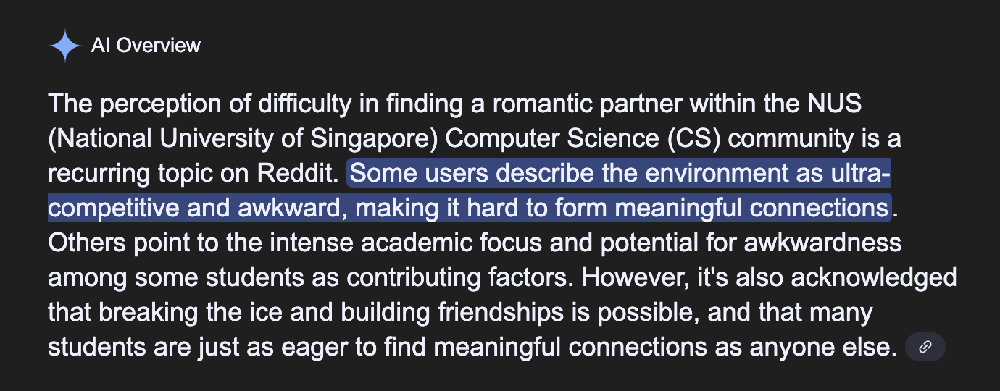

*Figure 1. Google AI summarising NUS CS student perceptions as “ultra-competitive and awkward” from Reddit threads*

Pencil Meets Case is conceived to address these challenges by offering a proximity‑based mobile application exclusively for NUS students. Our goal is to bridge the gap between digital matchmaking and real‑world conversations, fostering genuine, face‑to‑face meetups in safe, familiar campus environments. Key aspects of our scope include:

* **Proximity Matching:** Leveraging real‑time location data (with user consent and privacy controls) to allow users to see nearby students on the app too.
* **User Preferences & Filtering:** Allowing users to specify interests, goals, and visibility windows (e.g., class breaks), ensuring matches are relevant and timely.

Our app retains the familiar swiping paradigm—users can tap on nearby profiles on the map to open a card view, then swipe right to express interest or left to pass—while layering in proximity-based notifications. Key features include:

* **Simple Onboarding & Profile Setup:** Quick account creation with photo uploads, interests, and preferences.
* **Swipe Actions:** Traditional left/right swipe on the profile card drives the matching logic and like counters.
* **Instant Chat Integration:** Once matched, users can seamlessly transition into an in-app chat to plan their meetup.
* **Privacy Controls:** Fine-grained settings let users control when and how their location is shared.

These foundational features ensure an intuitive experience by combining proven swipe mechanics with real-world proximity, setting the stage for richer community and safety tools as the app evolves.

## 

## Proposed Level of Achievement

Apollo 11

For our project, we propose a level of achievement that reflects our ambition to transform on-campus socialising for NUS students. Pencil Meets Case is a mobile application that brings together live, map-based discovery of nearby peers, familiar swipe-to-match interactions, and seamless in-app chat, all in one cohesive platform. Our goal is to enable spontaneous, face-to-face connections by simplifying every step—from finding someone nearby to arranging a meetup—while giving users full control over their visibility and privacy.

## Tech Stack for Milestone 3

* **React Native (Expo):** Cross-platform mobile interface for iOS and Android
* **Firebase Authentication:** Secure email/password sign-up and login flows
* **Firestore: **Stores user profiles, swipe interactions, live location data, and chat messages with real-time listeners
* **Cloudinary:** Hosts all user-uploaded profile photos (we save only the URLs in Firestore)
* **Jest**: JavaScript testing framework used to run unit tests on UI flows, screen interactions, and Firebase logic in a simulated environment

## Milestone 3 Poster and Video

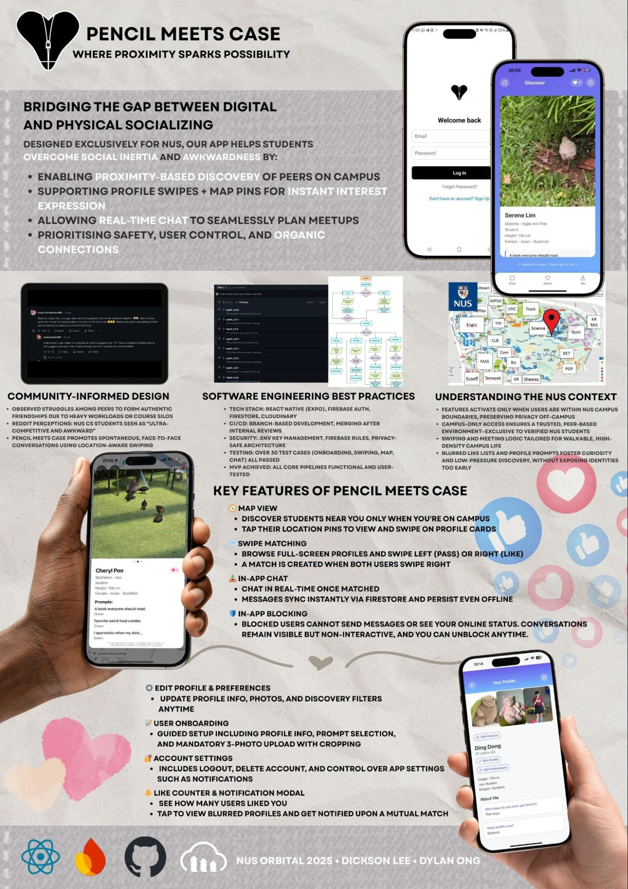

Link to Milestone 3 Video: [https://drive.google.com/file/d/13nzDpeUoEdDGKwbjjfQ0_5LfwMLy90vS/view?usp=sharing](https://drive.google.com/file/d/13nzDpeUoEdDGKwbjjfQ0_5LfwMLy90vS/view?usp=sharing)

## Features implemented

### **Feature 1: User Onboarding & Authentication**

* Secure Email/Password Sign-up & Login

Users sign up or log in simply by entering their email address and a strong password. Passwords must be at least eight characters long and include an uppercase letter, a number, and a special symbol for extra security. Firebase Authentication validates credentials instantly and shows clear, inline messages if there’s an issue. During sign-up, users also enter their birthdate and the system verifies they are at least 18 years old as of their birth month. Anyone under 18 by that date cannot complete the registration.

    

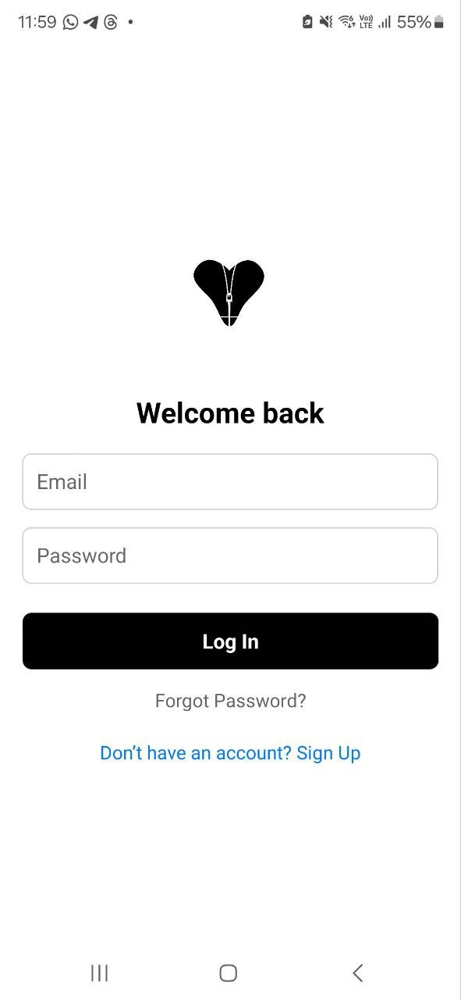

    *Figure 2. Sign-In Page *

To sign-in, simply tap the “Log In” button after keying in the user Email and Password (Figure 2), which would then navigate them to the app’s homepage. 

* Deferred Firestore Profile Creation

We don’t write anything to our database until a new user completes their profile. After registration, users fill in all required details—name, birthdate, gender, education, etc.—and only when they tap Save Profile do we create their Firestore document under /users/{uid}. This keeps our database free of partial or abandoned accounts.

* Conditional Navigation Flow

First-time users tap “Don’t have an account? Sign Up”, and are guided straight to the account creation page for user account creation. 

    

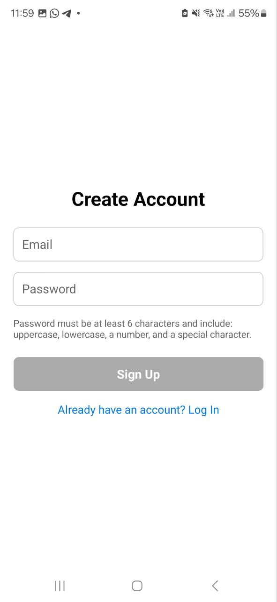

    *Figure 3. User account creation page*

To sign up, key in an email and a password that matches the said criteria to light up the “Sign Up” button and tap it to continue with profile creation. (Figure 3)

### **Feature 2: Profile Personalisation**

* Customisable Display Details

During onboarding, users complete all required fields—age, location, education, interests, and more—and those entries are then shown on their public profile. By deciding how they answer each field, users control the narrative of their profile and ensure it highlights the aspects of themselves they value most. (Figure 4)

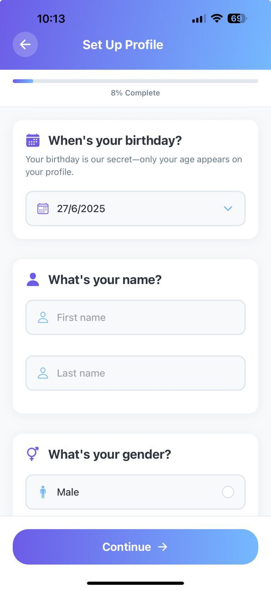

*Figure 4. Setting up personal details for profile page *

Each question presents a set of options; users simply tap their choice to respond. This streamlined interaction keeps the process fast and intuitive, ensuring a smooth, user-friendly experience. If any required field or option is left blank, the app displays an inline error message naming the specific item (for example, “Please indicate your gender”) and keeps the user on the same page until they provide the missing information.

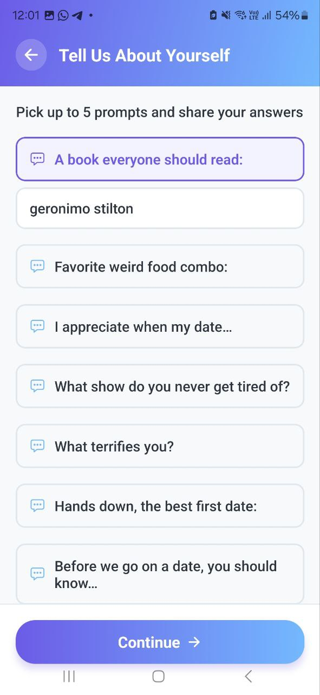

*Figure 5. Setting up profile with prompts*

* Personal Prompts Selection

Users browse a curated list of engaging questions—such as “What’s your favourite weird food combo?” or “What terrifies you?”—and choose up to five to answer. Their selected prompts and responses then appear on their profile (Figure 5), adding personality and conversation starters beyond the basic statistics. If a user tries to proceed without selecting at least one prompt, an error message appears and they remain on the prompt selection page until they choose a prompt.

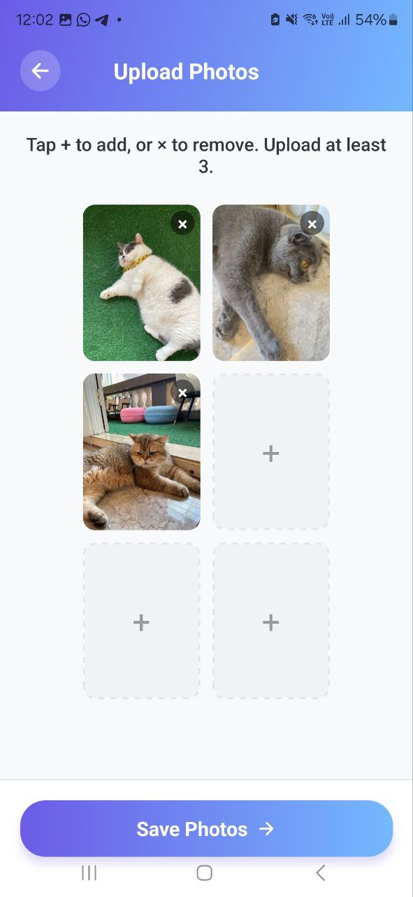

*Figure 6. Photo upload page for profile set up*

* Photo Upload & Cropping

Users tap the **“+”** icon in any empty frame to open their device gallery and select up to six images. After choosing a photo, they crop it to the app’s required dimensions—this optimisation ensures images load quickly and display correctly within our interface. Once they have uploaded at least three photos, tapping the “Save Photos” button uploads the images to Cloudinary (Figure 6) and moves them to the next step. If they try to save with fewer than three photos, an error message “Please upload at least 3 photos” appears, prompting them to upload at least 3 images before proceeding.

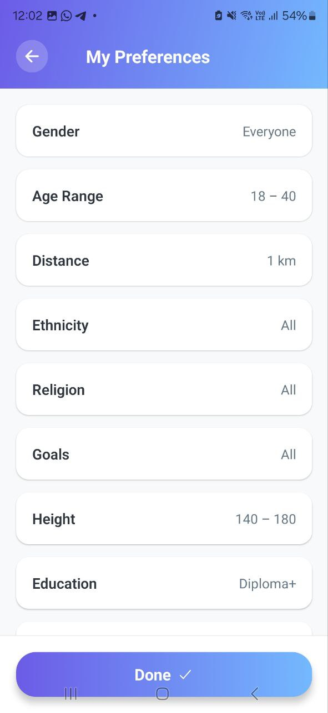

*Figure 7. Preferences page to personalise user preferences*

* Discovery Preferences

Users set their ideal match criteria, such as gender, age range, maximum distance, relationship goals, lifestyle habits, and education level (Figure 7), to tailor their feed and ensure they’re shown only the profiles that matter most to them.

### **Feature 3: Profile Customi**s**ation**

* Edit Profile

Users can revisit their profile at any time to update personal details such as name, bio, or stats, ensuring their information stays current. They can do so by clicking on the “Edit Profile” button shown in the “Your Profile” page. (Figure 8)

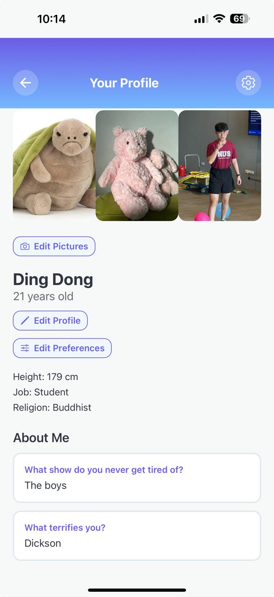

    *Figure 8. User’s Profile Page*

* Update Photos

From the profile screen, users can also add, remove, or re-crop images, with the same three-photo minimum enforced and error prompts if requirements aren’t met. Likewise, they can click on the “Edit Pictures” button to access the page to edit the pictures. (Figure 8)

* Modify Discovery Preferences

On the same page, users can adjust their match criteria (gender, age range, distance, relationship goals, habits, education, etc.) to refine who they see at any point in time. Simply click on the “Edit Preferences” button to access the page to edit their preferences. (Picture 8)

### **Feature 4: Account Settings & Security**

## 

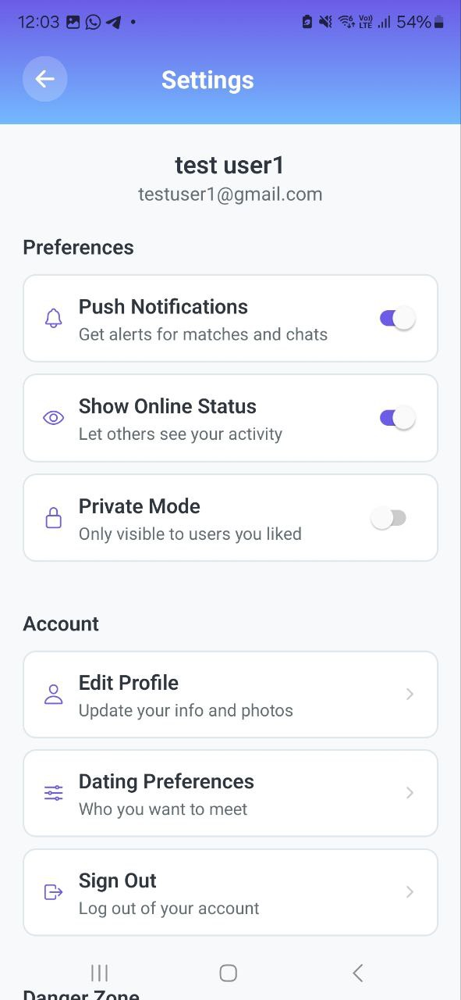

*Figure 9. User settings page to edit In-App Settings*

* In-App Settings

A dedicated Settings page lets users tweak app behaviors—such as notification preferences, privacy options, and account management—without leaving the main interface. These preferences can be changed by clicking on the toggle buttons to turn on or turn off the given options. (Figure 9)

* Sign Out

Users can securely log out of their account with a single tap, returning to the Login screen via the “Sign Out” button. (Figure 9)

* Delete Account

Offering a clear, easy-to-find “Delete Account” option is vital for respecting user autonomy and privacy. (Figure 10) When a user chooses to delete their account, they permanently remove all personal data—from profile details and photos to activity history—ensuring that no residual information remains on our servers. This capability not only builds trust by giving users full control over their data, but it also helps us comply with data-protection regulations and reinforces our commitment to protecting user rights. Before finalising, users must confirm the deletion to prevent accidental loss of their account.

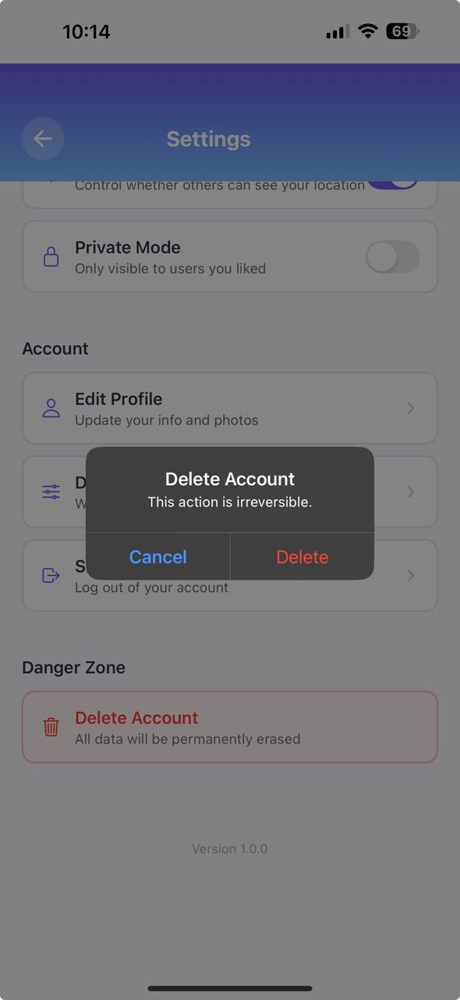

*  Figure 10. Delete account function*

### **Feature 5: Near Proximity Matching (Core)**

* Campus-Only Proximity Detection 

The app would check whether a user’s device is located within the NUS campus boundary when they click on the “Meet!” button in Home Page. Only when the user is on campus does the Proximity Matching feature activate, protecting privacy by preventing location sharing when students are off-campus (Figure 11).

           	                  

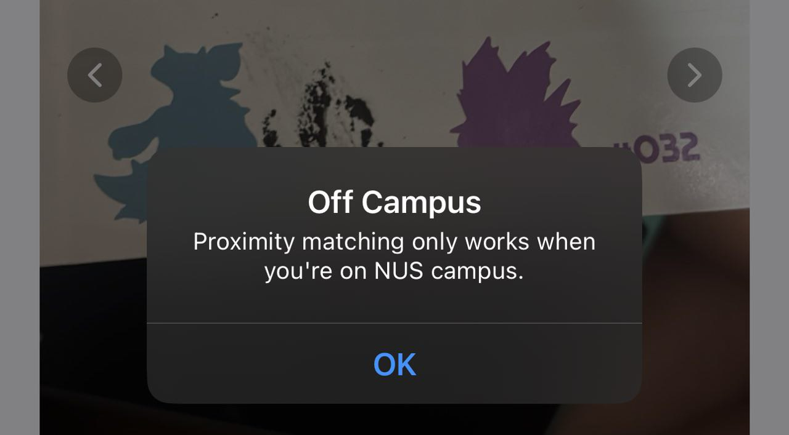

*  Figure 11. Proximity matching does not activate when user is not in NUS*

* Interactive Map View 

                

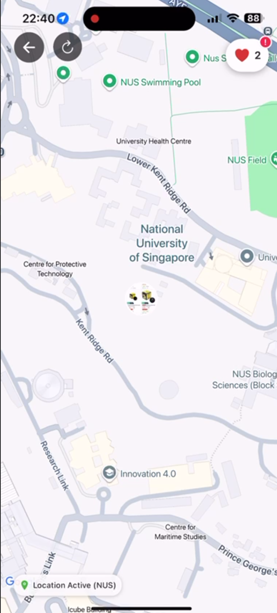

*  Figure 12. Proximity matching activated when user is in NUS*

Once on campus, users tap the “Meet!” button to see other active users displayed as pins overlaid on a campus map (Figure 12).  Tapping a pin opens that person’s profile card, where users can review photos, stats, and prompt responses (Figure 13) before swiping right (Like) or left (Pass).

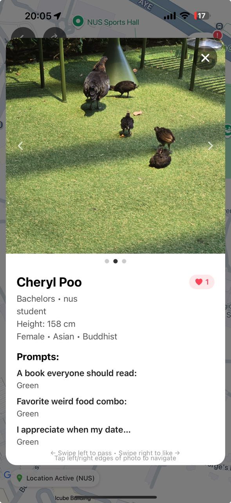

*Figure 13. Profile card of another user*

### 

### **Feature 6: In-App Messaging (Core)**

* Secure Real-Time Chat

Messages sync instantly between matched users using Firestore’s live database and offline persistence—so conversations update in real time and queue up when a device goes offline.

* User Flow

After a successful match, users can initiate conversations by tapping on the Chat icon from either the match notification or a user's profile card. This opens the Chat Overview screen, where all recent conversations are displayed in descending order of recency (Figure 14).

Tapping on a chat entry opens the dedicated conversation interface (Figure 15), where users can exchange messages in real time. The interface features a clean and intuitive layout, including a text input field, emoji keyboard, and a send button styled in Pencil Meets Case’s brand color.

*Figure 14. Chat Overview Screen*

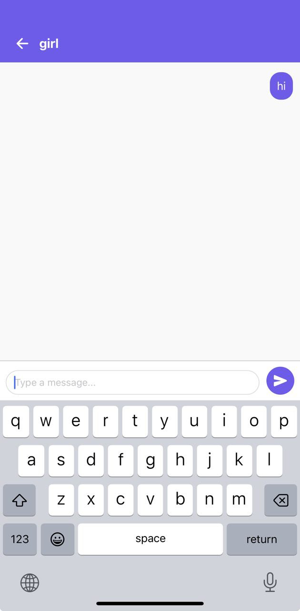

*Figure 15. In-app chat*

### **Feature 7: Swipe-Based Profile Discovery (Core)**

* Gender-Based Filtering & Full-Screen Profile Cards

Candidates are filtered according to each user’s required genders, ensuring every profile shown matches that fundamental preference. Each card then displays photos, basic stats (age, location, education), and prompt responses—allowing users to read through details like smoking/drinking habits or relationship goals before deciding (Figure 16). While those secondary attributes are visible, they aren’t used to pre-filter the queue, giving users the flexibility to judge for themselves which traits truly matter.

* Intuitive Swipe Actions

Swipe Right (Like): Signals interest in the displayed profile.

Swipe Left (Dislike): Dismisses the profile and moves on.

Gestures are quick and ergonomic, allowing one-handed operation.

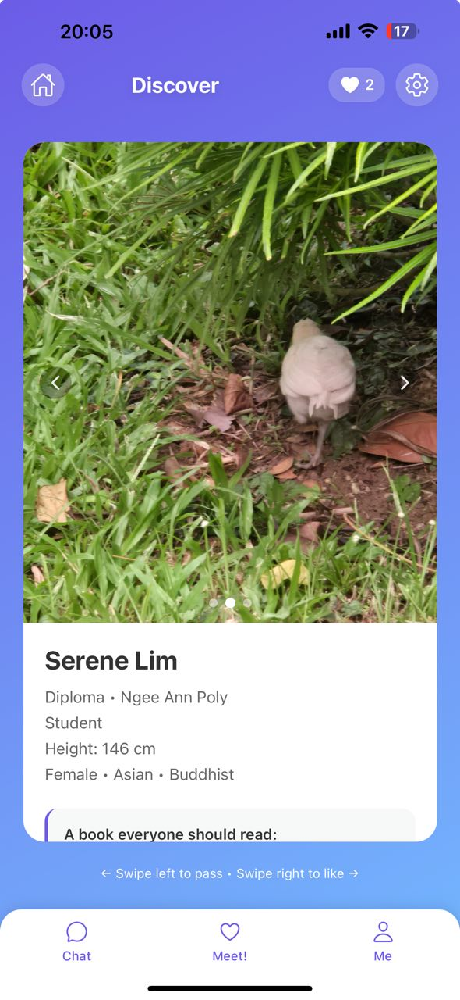

*Figure 16. Discovery Screen*

* Mutual Match Handling

When two users both swipe right on each other, a match is created. Both users receive an in-app notification letting them know they’ve matched and inviting them to start a conversation.

* Real-Time “Likes” Counter

On the same swipe page, a Likes Counter (Figure 17) shows how many people have already liked the user’s profile. Tapping the counter opens a view of those profiles, but images remain blurred until mutual interest is confirmed—maintaining curiosity and some anonymity while keeping users engaged.

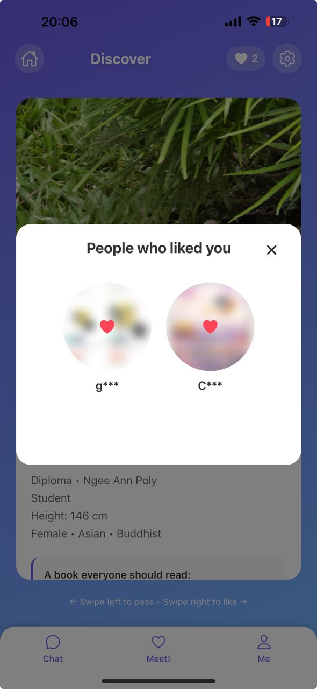

*Figure 17. Like counter*

* User Flow

From the Home page, users land on their first profile card. They swipe right to like or left to pass. The app instantly presents the next candidate. If both users like each other, a match is created and users receive a prompt to start chatting.

## Features implemented in MS3

### **Feature 8: Online Status (Extension)**

* Online status

The online status feature enhances communication by indicating when a user is actively using the app. Within each chat screen, users can see whether their chat partner is currently "Online" or view a timestamp such as "Last seen 2h ago" to understand recent activity (Figure 18).

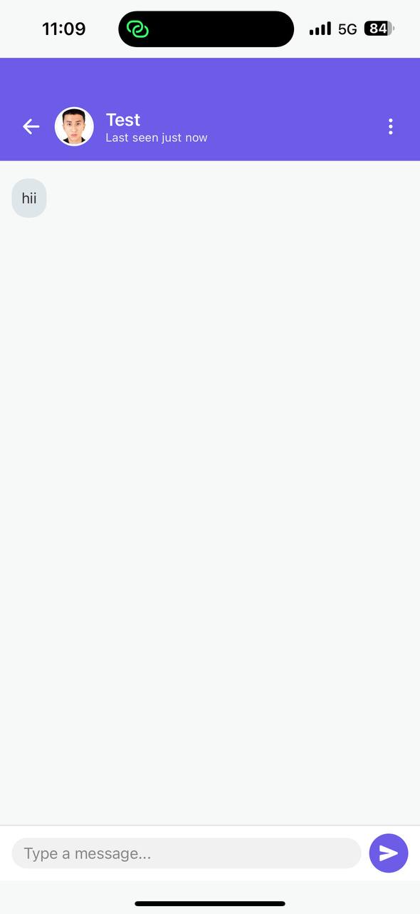

*Figure 18. Online status*

### Feature 9: **Safety and Privacy Toolkit (Extension)**

* In-App Blocking System

Users can block others directly from the 3-dot menu within any chat screen (Figure 19). Once a user is blocked, the offending party is no longer able to send messages or view the blocker’s online activity (Figure 20). The conversation remains visible for reference but becomes non-interactive. A confirmation message is shown upon blocking (Figure 21), and users can later return to the same menu to unblock if desired (Figure 22).

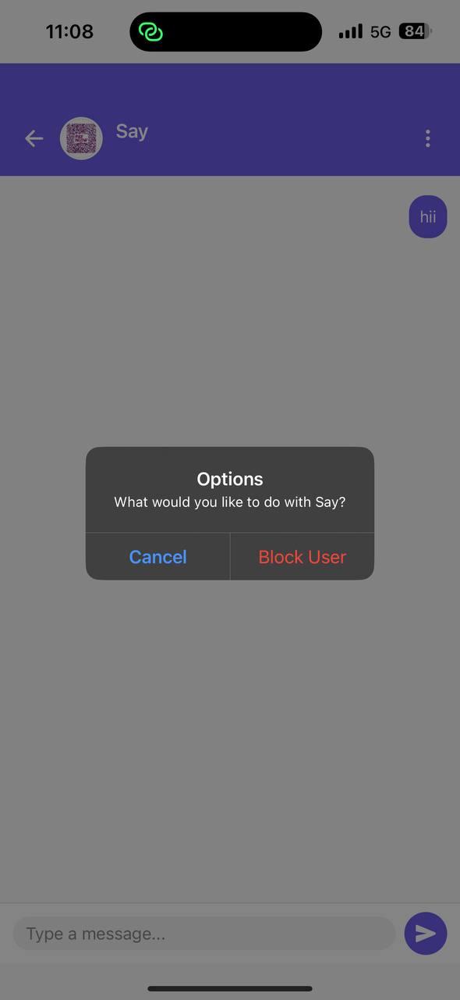

*Figure 19. Option to block user*

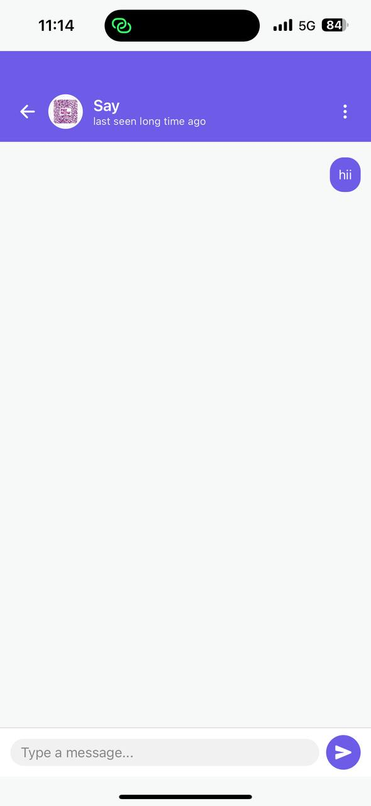

*Figure 20. Inability to send message and see online status*

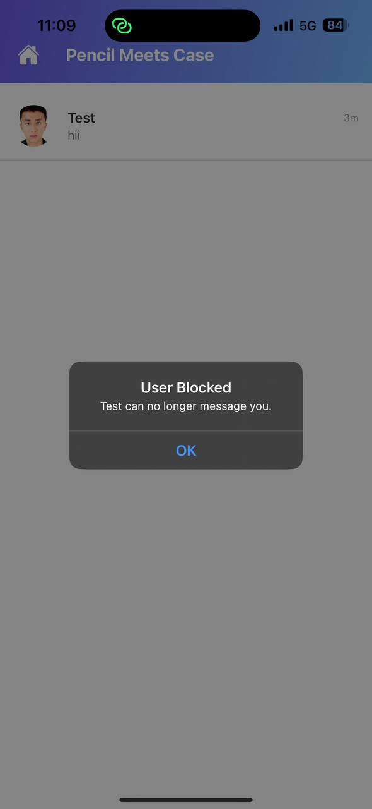

*Figure 21. Confirmation message*

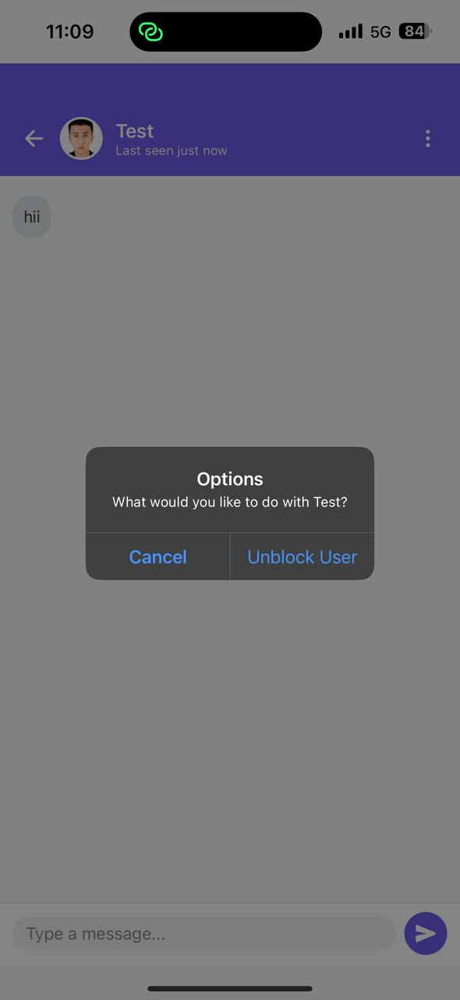

*Figure 22. Option to unblock user*

* Settings-based Control

In the Settings screen, users can manage key privacy controls (Figure 23) related to their visibility and activity. The Location Sharing toggle allows users to stop automatic updates of their live location, preventing the app from tracking or broadcasting their movements in real time. Meanwhile, the Online Status Visibility option lets users prevent others from seeing whether they are currently online or when they were last active. These settings empower users to maintain control over how much personal presence data they share within the app.

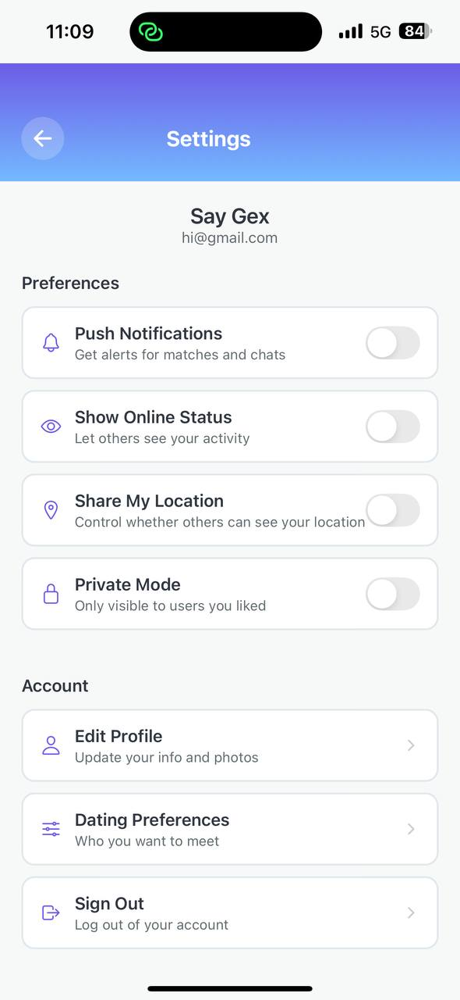

*Figure 23. Privacy Controls*

## Issues Faced

### Text Not Rendering in Preferences Page (APK Build Only)

One persistent issue encountered occurs on the Preferences screen. Several fields such as Age Range and Distance are fully functional (touchable and value-selectable), but the text values do not visibly render in the allocated areas (Figure 24). 

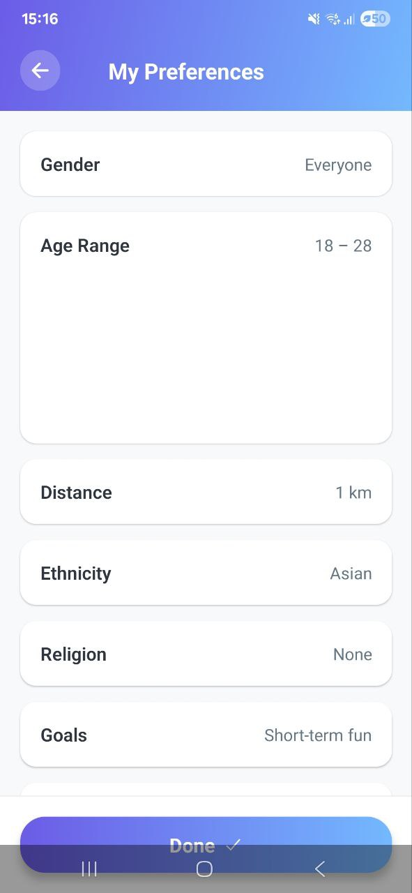
 \
 \
*Figure 24. Rendering issues*

* Does not appear in Expo Go, where everything renders correctly.
* Occurs only after building and installing the APK, which suggests a possible rendering issue specific to the native Android build pipeline.

Despite trying numerous fixes, including changing text color, layout styles, container dimensions, the issue persists. 

Based on debugging and research, the root cause may be due to:

* Differences in rendering behavior between Expo Go (JavaScript runtime) and compiled APK (native bridge),
* Font fallback or asset loading failures in the APK build (missing bundled font or font-weight incompatibility),
* Android-specific layout behavior, where nested views or missing overflow, position, or width properties may prevent text from appearing.

This issue remains unresolved and is being highlighted for future debugging post-Milestone 3. The functionality is unaffected, but it results in degraded user experience on the released APK version.

## 

## Limitations of Pencil Meets Case:

1. **Unknown performance of the app under high traffic volume**

    Under normal testing conditions, our app seems to have no issues operating. However, we have not conducted stress testing to assess the performance of Pencil Meets Case under heavy load.

    Following the standard practice of software engineering, we should not wait till the production phase to identify and fix bugs caused by high traffic volume.

    To address this limitation, we plan to implement load testing using tools such as Locust, k6, or Firebase Performance Monitoring to simulate high user traffic and identify performance bottlenecks. Since our backend relies on Firebase, we will also optimise Firestore security rules and indexing to minimise query latency, and make use of offline persistence to reduce read operations. Additionally, we may incorporate queue-based write operations using Firebase Cloud Functions to handle concurrent writes more efficiently. By conducting these tests and optimisations early, we aim to ensure the app remains stable and responsive even under peak traffic conditions during campus-wide usage.

## 

## Project Management

**Introduction**

In order to facilitate software engineering practices, we have leveraged on some technologies to manage the work division and efficiency of our tasks to ensure that we are well on track to reach our objectives of Milestone 2. 

### **Github Issue Tracking**

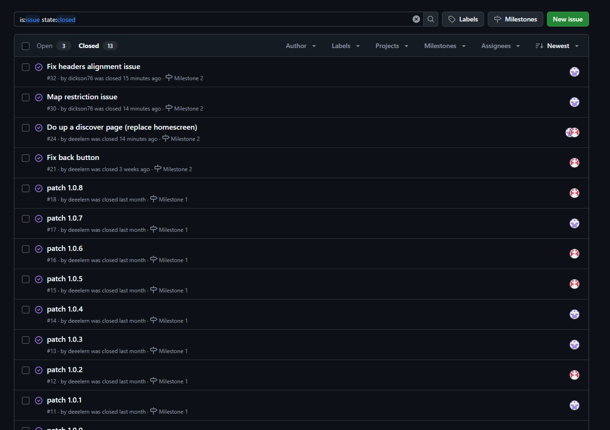

*  Figure 25. Github Issue Tracking*

To track development issues and keep our partner informed, we made use of GitHub Issues throughout the project. (Figure 25) While we did not make use of tagging features like bug or enhancement, we found issue logging helpful in recording ongoing problems or feature-related questions. Since we worked in a pair and communicated closely, it was easy to stay updated on the latest development challenges without the need for elaborate categorisation. The issue tracker mainly served as a shared space to document problems we encountered individually, which helped the other teammate understand the context and offer timely help if needed. This lightweight issue tracking approach fits well with our collaborative working style.

### Github Branching

Branching was used to isolate each teammate’s work and prevent accidental overwrites. This approach allowed us to safely experiment or build new functionality without affecting the main application. Since only one of us would work at a time, there was minimal risk of conflicting changes, and we were able to keep our branches clean and focused on one objective at a time.

### Github Merging

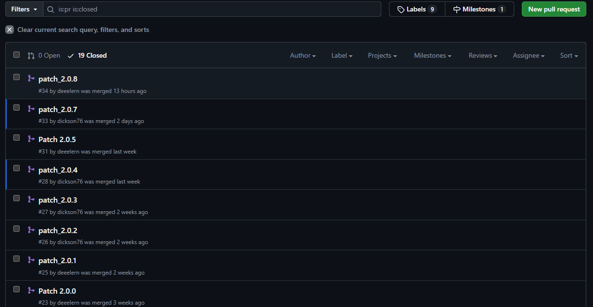

*Figure 26. Github Merging*

After completing work on a branch, we would perform internal testing and a quick peer walkthrough before merging. Once both members were aligned on the implementation, we would open a pull request to merge the feature branch into master. (Figure 26) This ensured that all code in master was reviewed and confirmed to be functional. We maintained this workflow consistently, especially before key milestones, to ensure that our main branch always reflected a stable, submission-ready version of the app.

## 

## Security Measures

In line with best practices in software engineering, we ensure that sensitive credentials such as API keys are never exposed publicly on platforms like GitHub. To safeguard this information, we store all keys securely in a .env file (Figure 27), as shown below:

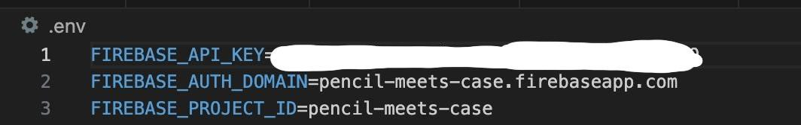

*Figure 27. *Keys under the “.env” file

## 

## Testing

To ensure the reliability, usability, and robustness of Pencil Meets Case, we conducted a comprehensive testing strategy across three layers: User Testing, Manual Test Cases, and Automated Unit Testing (Jest). Each approach targeted different aspects of the app—from real-user behavior to flow validation and logic-level correctness. This multi-pronged methodology helped us uncover both functional issues and UX friction points, enabling a smoother and more secure user experience.

### User Testing

Sample size: 5

Link to survey: [https://docs.google.com/forms/d/e/1FAIpQLSfZfOyicY5R2TpwVgxKkfpv3y6mqI48gKFdQFe38ce8a92YIQ/viewform?usp=dialog](https://docs.google.com/forms/d/e/1FAIpQLSfZfOyicY5R2TpwVgxKkfpv3y6mqI48gKFdQFe38ce8a92YIQ/viewform?usp=dialog)

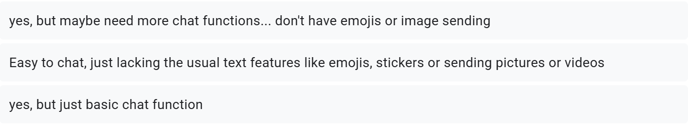

*Figure 28. Feedbacks for in-app chat*

Overall, the app has received positive feedback with the ease of use of our different functions. Other than the rendering issue that we have pointed out earlier, our in-app chat can be further improved with new functionalities and features (Figure 28).

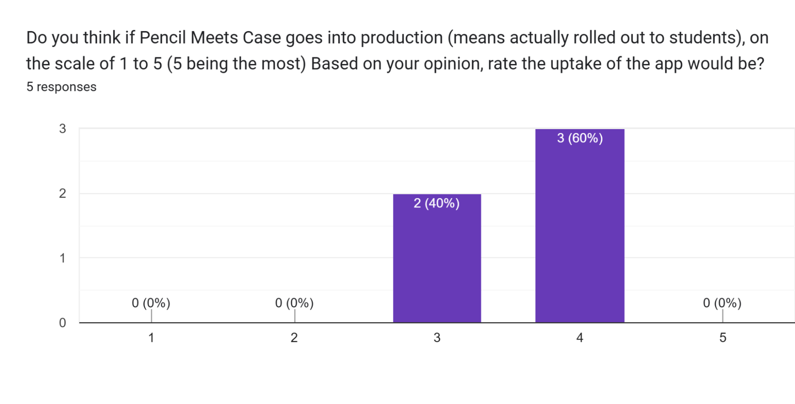

*Figure 29. Moderately high confidence in Pencil Meets Case to succeed*

Also, there is a moderately high confidence (Figure 29) in the app’s potential success and adoption rate, with users believing it would gain meaningful traction among the student body. The absence of low scores (1 or 2) suggests a generally favorable outlook toward the app’s concept and relevance.

 

### 

### Automated Unit Testing

To verify the correctness of individual components and logic functions at a granular level, we implemented automated unit tests using the Jest testing framework alongside @testing-library/react-native. These tests simulate user interactions—such as filling inputs, pressing buttons, and navigating between screens—and assert expected UI behavior, state updates, and Firestore writes.

By isolating and rigorously testing each screen's core functionality (e.g., form validation, navigation triggers, message sending, etc.), we can confidently detect regressions and ensure app stability as new features are introduced. However, due to time constraints, we were not able to conduct unit testing for all components of the app. Instead we identified a few key components to conduct the test, ensuring the usability of the app.

#### **SignUpScreen.test.js**

* In this test file, key components related to user sign-ups are covered (Figure 30), these includes:
    * Renders all input fields and button correctly
    * Allows user to input email and password
    * Calls handleSignUp with correct credentials on button press
    * Navigates to the Login screen when “Already have an account?” is pressed

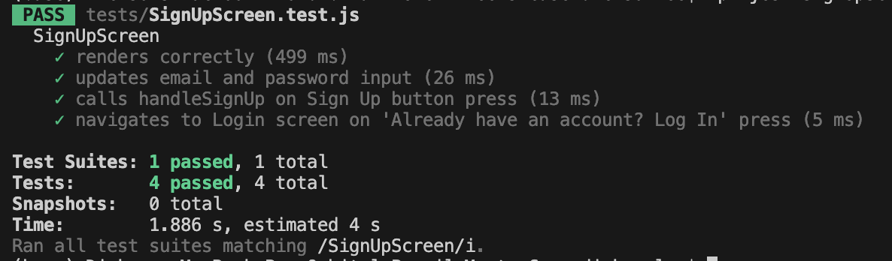
 \
*Figure 30. SignUpScreen.test.js*

#### **LogInScreen.test.js**

* In this test file, key components related to user log-ins are covered (Figure 31), these includes:
    * Renders all input fields and navigation prompts
    * Allows user to type in email and password
    * Calls onLogin with correct credentials on button press
    * Navigates to SignUpScreen via the “Don’t have an account?” link

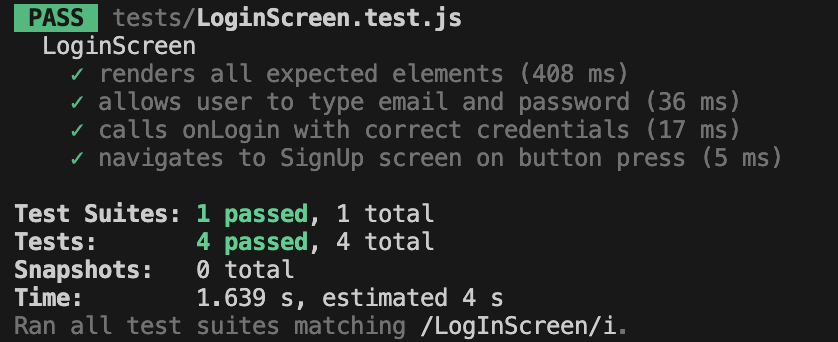

*Figure 31. LogInScreen.test.js*

#### 

#### **ProfileSetUpPart2Screen.test.js**

* In this test file, key components related to user profile set-up are covered (Figure 32), these includes:
    * Renders all prompt options correctly
    * Expands a selected prompt and allows text input
    * Shows alert if no prompt is answered
    * Shows alert if more than 5 prompts are answered
    * Navigates to PhotoUploadScreen if 1–5 prompts are answered
    * Calls setDoc and navigates to MeScreen when editing profile

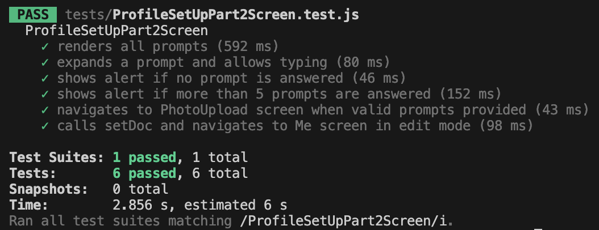

*Figure 32. ProfileSetUpPart2Screen.test.js*

#### **MyPreferenceScreen.test.js**

* In this test file, key components related to user preferences set-up are covered (Figure 33) , these includes:
    * Renders all preference categories (gender, smoking, etc.)
    * Shows alert if min age > max age
    * Navigates to HomeScreen if not editing
    * Navigates to MeScreen if editing

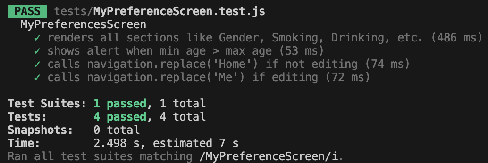

*Figure 33. MyPreferenceScreen.test.js*

#### **SettingsScreen.test.js**

* In this test file, key components related to user settings are covered (Figure 34), these includes:
    * Renders user profile data and toggles (notifications, location, etc.)
    * Toggles notification setting and updates Firestore
    * Navigates to Edit Profile setup screen
    * Navigates to My Preferences setup screen
    * Triggers sign-out confirmation flow
    * Triggers delete account confirmation flow

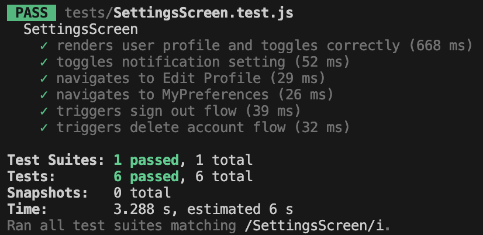

*Figure 34. SettingsScreen.test.js*

#### 

#### **ChatScreen.test.js**

* In this test file, key components related to user chats are covered (Figure 35), these includes:
    * Renders fallback UI when there are no chats
    * Renders a valid chat item and navigates to ChatRoomScreen
    * Filters out chats from blocked users
    * Navigates to HomeScreen when home icon is pressed

## 

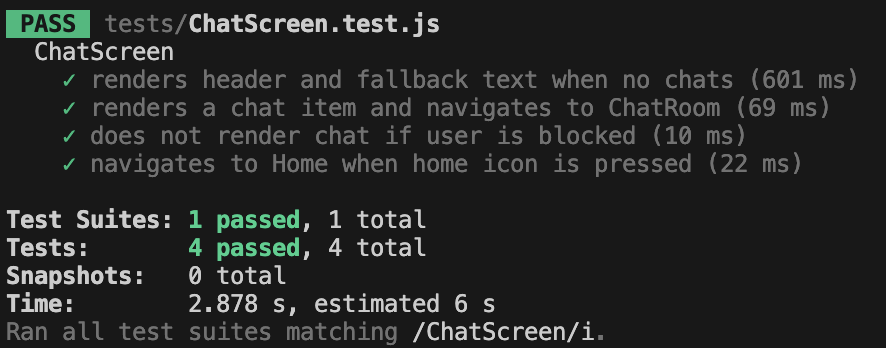

*Figure 35. ChatScreen.test.js*

#### 

#### **ChatRoomScreen.test.js**

* In this test file, key components related to user chat rooms are covered (Figure 36), these includes:
    * Renders chat header with other user’s name
    * Sends a message and triggers Firestore write
    * Prevents sending of empty messages
    * Blocks user via options menu and updates Firestore
    * Prevents message sending if current user is blocked by recipient

### 

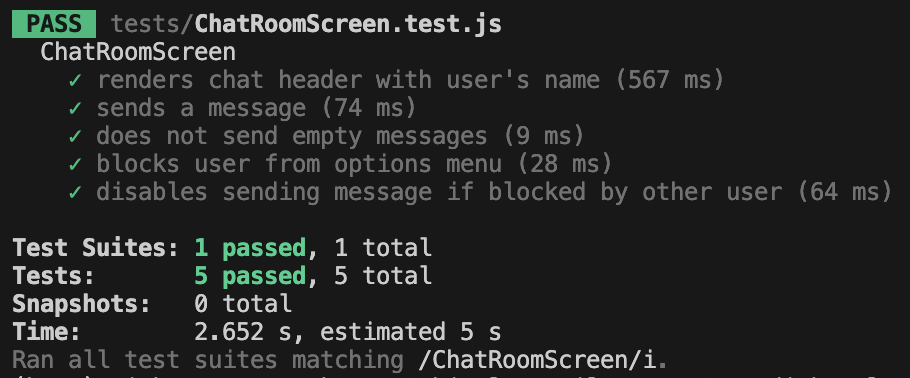

### *Figure 36. ChatRoomScreen.test.js*

### Manual Test Cases

Manual test cases were designed to validate core user flows and functional requirements through hands-on interaction with the app. Each scenario was executed step-by-step using realistic data and device conditions to verify that features such as onboarding, swiping, chat, and profile editing behave as expected. These tests helped catch edge cases and UI inconsistencies that might be missed by automated scripts, ensuring the app performs reliably across intended user actions.

#### **Pipeline 1: Onboarding Flow**

<table>
  <tr>
   <td colspan="5" >Test Case
   </td>
   <td colspan="2" >Results
   </td>
  </tr>
  <tr>
   <td>Test  

ID 
   </td>
   <td>User Story 
   </td>
   <td>Testing Objective 
   </td>
   <td>Steps Taken 
   </td>
   <td>Expected Results 
   </td>
   <td>Pass /  

Fail 
   </td>
   <td>Date Tested
   </td>
  </tr>
  <tr>
   <td rowspan="6" >P1
   </td>
   <td rowspan="6" >As a new user, I want to smoothly complete the onboarding process, from setting up my profile, uploading a photo, and selecting my preferences, so I can begin discovering and connecting with other students.
   </td>
   <td>Ensure user inputs in the Profile Set-up pages are validated and stored before proceeding
   </td>
   <td>
<ol>

<li>Render ProfileSetupScreen</li>

<li>Enter name, birthdate, gender and other details</li>

<li>Press “Continue”</li>
</ol>
   </td>
   <td>Navigates to PhotoUploadScreen with state preserved
   </td>
   <td>
    Pass
   </td>
   <td>
    23/7/25
   </td>
  </tr>
  <tr>
   <td>Validate image selection and preview rendering, ensuring at least 3 images are uploaded
   </td>
   <td>
<ol>

<li>Render PhotoUploadScreen</li>

<li>Mock image picker response</li>

<li>Press “Continue”</li>
</ol>
   </td>
   <td>Image URI shown in preview; passed to next screen
   </td>
   <td>
    Pass
   </td>
   <td>
    23/7/25
   </td>
  </tr>
  <tr>
   <td>Ensure preference selections are captured and stored
   </td>
   <td>
<ol>

<li>Render MyPreferencesScreen</li>

<li>Select interests</li>

<li>Complete profile setup</li>
</ol>
   </td>
   <td>Firestore updated with user data

and navigates to HomeScreen
   </td>
   <td>
    Pass
   </td>
   <td>
    23/7/25
   </td>
  </tr>
  <tr>
   <td>Validate that going back button works to change previously added details
   </td>
   <td>
<ol>

<li>Progress to any later screen</li>

<li>Press back button</li>

<li>Access past screens to edit details</li>
</ol>
   </td>
   <td>Navigated back to the previous screen
   </td>
   <td>
    Pass
   </td>
   <td>
    23/7/25
   </td>
  </tr>
  <tr>
   <td>Ensure that error messages appear if required fields are empty
   </td>
   <td>
<ol>

<li>Leave any onboarding screen with fields left blank (e.g. leave name blank)</li>

<li>Press “Continue”</li>
</ol>
   </td>
   <td>Error message shown, pointing out the empty field and user blocked from continuing
   </td>
   <td>
    Pass
   </td>
   <td>
    23/7/25
   </td>
  </tr>
  <tr>
   <td>Ensure that completing onboarding navigates user to HomeScreen
   </td>
   <td>
<ol>

<li>Complete all onboarding steps with valid data</li>

<li>Observe navigation at final submission</li>
</ol>
   </td>
   <td>Navigated to HomeScreen and can begin using the app
   </td>
   <td>
    Pass
   </td>
   <td>
    23/7/25
   </td>
  </tr>
</table>

#### **Pipeline 2: Swipe & Match (Home Screen)**

<table>
  <tr>
   <td colspan="5" >Test Case
   </td>
   <td colspan="2" >Results
   </td>
  </tr>
  <tr>
   <td>Test  

ID 
   </td>
   <td>User Story 
   </td>
   <td>Testing Objective 
   </td>
   <td>Steps Taken 
   </td>
   <td>Expected Results 
   </td>
   <td>Pass /  

Fail 
   </td>
   <td>Date Tested
   </td>
  </tr>
  <tr>
   <td rowspan="4" >P2
   </td>
   <td rowspan="4" >As a user, I want to swipe through all available profiles on the HomeScreen and get matched if someone I liked also liked me — so I can start chatting with mutual matches easily.
   </td>
   <td>Ensure swiping right adds target user to likedUsers array in Firestore
   </td>
   <td>
<ol>

<li>Render HomeScreen with mock users</li>

<li>Simulate swipe right</li>

<li>Verify Firestore write</li>
</ol>
   </td>
   <td>Current user's likedUsers updated with swiped UID
   </td>
   <td>
    Pass
   </td>
   <td>
    23/7/25
   </td>
  </tr>
  <tr>
   <td>Ensure swiping left does not update Firestore
   </td>
   <td>
<ol>

<li>Render HomeScreen with mock users</li>

<li>Simulate swipe left gesture</li>

<li>Confirm no Firestore write</li>
</ol>
   </td>
   <td>No write occurs; user skipped silently
   </td>
   <td>
    Pass
   </td>
   <td>
    23/7/25
   </td>
  </tr>
  <tr>
   <td>Detect mutual match and display match modal
   </td>
   <td>
<ol>

<li>Mock: target user already liked current user</li>

<li>Simulate swipe right</li>

<li>Trigger modal pop-up</li>
</ol>
   </td>
   <td>Modal pop-up showing that user has successfully matched with the other user
   </td>
   <td>
    Pass
   </td>
   <td>
    23/7/25
   </td>
  </tr>
  <tr>
   <td>Ensure like counter shows users who liked you
   </td>
   <td>
<ol>

<li>Use mock user to like current user by swiping on HomeScreen</li>

<li>Tap on likes counter to see other users who liked the current user</li>
</ol>
   </td>
   <td>Able to see blurred profile picture of mock user used to like the current user
   </td>
   <td>
    Pass
   </td>
   <td>
    23/7/25
   </td>
  </tr>
</table>

#### **Pipeline 3: Swipe & Match (Map Screen)**

<table>
  <tr>
   <td colspan="5" >Test Case
   </td>
   <td colspan="2" >Results
   </td>
  </tr>
  <tr>
   <td>Test  

ID 
   </td>
   <td>User Story 
   </td>
   <td>Testing Objective 
   </td>
   <td>Steps Taken 
   </td>
   <td>Expected Results 
   </td>
   <td>Pass /  

Fail 
   </td>
   <td>Date Tested
   </td>
  </tr>
  <tr>
   <td rowspan="6" >P3
   </td>
   <td rowspan="6" >As an NUS student, I want to see other users currently on campus via the map, click on their profile, and swipe to match if I'm interested — so I can meet people who are nearby and connect in real life.
   </td>
   <td>Ensure only campus users are shown on the map
   </td>
   <td>
<ol>

<li>Create mock users with location field inside and outside NUS bounds</li>

<li>Render MapScreen</li>

<li>Check visible markers</li>
</ol>
   </td>
   <td>Only markers for users with NUS-based location appear
   </td>
   <td>
    Pass
   </td>
   <td>
    23/7/25
   </td>
  </tr>
  <tr>
   <td>Ensure tapping marker opens user profile modal
   </td>
   <td>
<ol>

<li>Tap on visible user marker</li>

<li>Check modal visibility</li>
</ol>
   </td>
   <td>Profile modal opens with correct user data
   </td>
   <td>
    Pass
   </td>
   <td>
    23/7/25
   </td>
  </tr>
  <tr>
   <td>Ensure swipe right from modal updates likedUsers
   </td>
   <td>
<ol>

<li>Inside modal, simulate swipe right</li>

<li>Check Firestore update</li>
</ol>
   </td>
   <td>Swiped user's UID added to likedUsers
   </td>
   <td>
    Pass
   </td>
   <td>
    23/7/25
   </td>
  </tr>
  <tr>
   <td>Ensure swiping left does not update Firestore
   </td>
   <td>
<ol>

<li>Render Map Screen with mock users</li>

<li>Simulate swipe left gesture</li>

<li>Confirm no Firestore write</li>
</ol>
   </td>
   <td>No write occurs; user skipped silently
   </td>
   <td>
    Pass
   </td>
   <td>
    23/7/25
   </td>
  </tr>
  <tr>
   <td>Detect mutual match and show modal 

<pre class="prettyprint">
</pre>

   </td>
   <td>
<ol>

<li>Mock user who already liked you</li>

<li>Swipe right for the mock user in modal </li>

<li>Check for matches write and modal appearance</li>
</ol>
   </td>
   <td>Match modal popup shown; Firestore match created
   </td>
   <td>
    Pass
   </td>
   <td>
    23/7/25
   </td>
  </tr>
  <tr>
   <td>Ensure like counter shows users who liked you
   </td>
   <td>
<ol>

<li>Use mock user to like current user by swiping on Map Screen</li>

<li>Tap on likes counter to see other users who liked the current user</li>
</ol>
   </td>
   <td>Able to see blurred profile picture of mock user used to like the current user
   </td>
   <td>
    Pass
   </td>
   <td>
    23/7/25
   </td>
  </tr>
</table>

### 

#### **Pipeline 4: Chat & Messaging**

<table>
  <tr>
   <td colspan="5" >Test Case
   </td>
   <td colspan="2" >Results
   </td>
  </tr>
  <tr>
   <td>Test  

ID 
   </td>
   <td>User Story 
   </td>
   <td>Testing Objective 
   </td>
   <td>Steps Taken 
   </td>
   <td>Expected Results 
   </td>
   <td>Pass /  

Fail 
   </td>
   <td>Date Tested
   </td>
  </tr>
  <tr>
   <td rowspan="4" >P4
   </td>
   <td rowspan="4" >As a matched user, I want to chat securely within the app so that I can have meaningful conversations to further understand the other party
   </td>
   <td>Ensure chat modal opens after match
   </td>
   <td>
<ol>

<li>Simulate mutual match</li>

<li>Tap “Chat” in Home page</li>
</ol>
   </td>
   <td>Able to see matched user in Chat Screen
   </td>
   <td>
    Pass
   </td>
   <td>
    23/7/25
   </td>
  </tr>
  <tr>
   <td>Ensure messages can be sent and stored in Firestore
   </td>
   <td>
<ol>

<li>Type message in chat input</li>

<li>Press “send” arrow button to send message</li>

<li>Check Firestore write</li>
</ol>
   </td>
   <td>Message is added to messages subcollection in firestore
   </td>
   <td>
    Pass
   </td>
   <td>
    23/7/25
   </td>
  </tr>
  <tr>
   <td>Ensure messages appear in real-time via listener
   </td>
   <td>
<ol>

<li>Mock user sends message to user</li>

<li>Check chat render on user account</li>
</ol>
   </td>
   <td>Messages show instantly in correct order
   </td>
   <td>
    Pass
   </td>
   <td>
    23/7/25
   </td>
  </tr>
  <tr>
   <td>Ensure ChatScreen displays unread message count and latest message per chat
   </td>
   <td>
<ol>

<li>Mock multiple match threads with messages</li>

<li>Some messages marked as unread</li>

<li>Render ChatScreen</li>
</ol>
   </td>
   <td>Each chat item shows: (a) last message text preview, (b) number of unread messages count 
   </td>
   <td>
    Pass
   </td>
   <td>
    23/7/25
   </td>
  </tr>
</table>

** \
**

#### **Pipeline 5: Profile & Preference Editing**

<table>
  <tr>
   <td colspan="5" >Test Case
   </td>
   <td colspan="2" >Results
   </td>
  </tr>
  <tr>
   <td>Test  

ID 
   </td>
   <td>User Story 
   </td>
   <td>Testing Objective 
   </td>
   <td>Steps Taken 
   </td>
   <td>Expected Results 
   </td>
   <td>Pass /  

Fail 
   </td>
   <td>Date Tested
   </td>
  </tr>
  <tr>
   <td rowspan="4" >P5
   </td>
   <td rowspan="4" >As a user, I want to be able to update my profile details or preferences at any time — so I can reflect changes in identity, interests, or personality as I grow.
   </td>
   <td>Ensure EditProfileScreen displays current user info
   </td>
   <td>
<ol>

<li>Create a mock user account</li>

<li>Head to “Me” screen</li>

<li>Select edit profiles</li>
</ol>
   </td>
   <td>Pre-existing profile details are all still recorded in the edit profile screen
   </td>
   <td>
    Pass
   </td>
   <td>
    23/7/25
   </td>
  </tr>
  <tr>
   <td>Ensure user can update and submit new profile info
   </td>
   <td>
<ol>

<li>In a mock user account, change fields like name, age, bio</li>

<li>2. Press “Save”</li>
</ol>
   </td>
   <td>Firestore users document updated based on changes
   </td>
   <td>
    Pass
   </td>
   <td>
    23/7/25
   </td>
  </tr>
  <tr>
   <td>Prevent empty/invalid values during update
   </td>
   <td>
<ol>

<li>Clear required fields</li>

<li>Attempt to save</li>
</ol>
   </td>
   <td>Error shown; update is blocked
   </td>
   <td>
    Pass
   </td>
   <td>
    23/7/25
   </td>
  </tr>
  <tr>
   <td>Ensure changes persist across sessions
   </td>
   <td>
<ol>

<li>Update profile and restart app</li>

<li>Log back in</li>

<li>Render profile page</li>
</ol>
   </td>
   <td>Previously updated info appears correctly from Firestore \
 \
Checking the profile details again should also reflect the new changes
   </td>
   <td>
    Pass
   </td>
   <td>
    23/7/25
   </td>
  </tr>
</table>

## Proposed User Flow

## 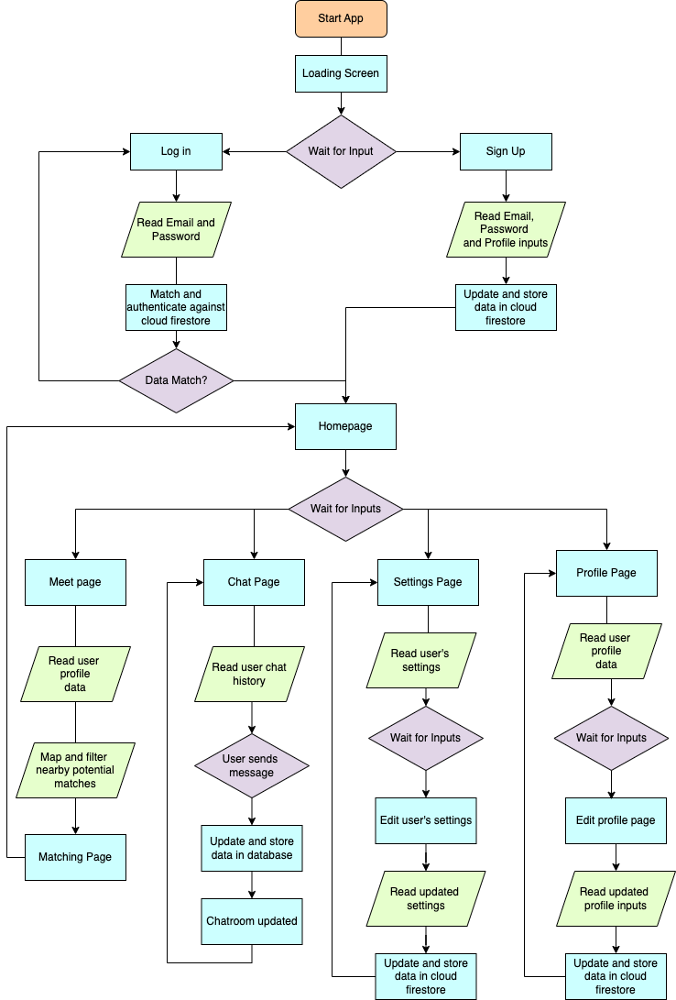

## Development Plan

<table>
  <tr>
   <td><strong>Task</strong>
   </td>
   <td><strong>Description</strong>
   </td>
   <td><strong>Date</strong>
   </td>
  </tr>
  <tr>
   <td>Prepare Liftoff Poster and Video
   </td>
   <td>Create the liftoff Poster and record a 1-min pitch to summarise app concept 
   </td>
   <td>19 May 2025
   </td>
  </tr>
  <tr>
   <td>Pick Up Necessary Skills	
   </td>
   <td>Familiarise with core technologies: React Native, Firebase (Auth, Firestore), Expo, and Git workflows.
   </td>
   <td>20 - 23 May 2025
   </td>
  </tr>
  <tr>
   <td>Prototype Creation	
   </td>
   <td>Design and prototype key pages like Sign Up, Profile Setup, Preferences, and Profile View.
   </td>
   <td>24 May - 28 May 2025
   </td>
  </tr>
  <tr>
   <td>Implement Authentication	
   </td>
   <td>Integrate Firebase Authentication to enable sign up and log in via email and password.
   </td>
   <td>29 May 2025
   </td>
  </tr>
  <tr>
   <td>Create Profile Setup Flow	
   </td>
   <td>Build multistep onboarding: user info form → prompt responses → photo upload → preferences selection.
   </td>
   <td>30 May 2025
   </td>
  </tr>
  <tr>
   <td>Create logical navigation, features and pages
   </td>
   <td>Enable Profile Editing, Develop In-App Navigation, Build Preferences Module, Build Profile View, Implement Settings Page
   </td>
   <td>31 May - 1 Jun 2025
   </td>
  </tr>
  <tr>
   <td colspan="2" >Milestone 1: Core Flow + Authentication
<ul>

<li>Ideation (Readme)</li>

<li>Proof of Concept:</li> 
<ul>
 
<li>Sign Up / Log In via Firebase Auth</li>
 
<li>Profile Setup (Info, Prompts, Photos, Preferences)</li>
 
<li>Profile Edit from Me Screen</li>
 
<li>Navigation between Home, Profile, Settings</li> 
</ul></li> 
</ul>
   </td>
   <td>2 Jun 2025
   </td>
  </tr>
  <tr>
   <td>Implement In-App Chat	
   </td>
   <td>Enable real-time private messaging using Firebase or external SDK
   </td>
   <td>3 - 7 Jun 2025
   </td>
  </tr>
  <tr>
   <td>Build Geolocation Matching Engine	
   </td>
   <td>Integrate device geolocation and design proximity-based user discovery.
   </td>
   <td>8 - 15 Jun 2025
   </td>
  </tr>
  <tr>
   <td>Proximity Notification Logic	
   </td>
   <td>Alert user when someone within preference range is nearby (campus-based).
   </td>
   <td>16 - 18 Jun 2025
   </td>
  </tr>
  <tr>
   <td>Start ‘Discover’ / Matching Page
   </td>
   <td>Build frontend UI for discovering matched users (based on distance or filters).
   </td>
   <td>19 - 23 Jun 2025
   </td>
  </tr>
  <tr>
   <td>Refine Firestore Structure
   </td>
   <td>Optimise how profiles, messages, and preferences are stored and queried.
   </td>
   <td>24  - 25 Jun 2025
   </td>
  </tr>
  <tr>
   <td>Debugging & Testing	
   </td>
   <td>Conduct early tests to check form flow, Firestore writes, and proper merging of updates.
   </td>
   <td>26 - 29 Jun 2025
   </td>
  </tr>
  <tr>
   <td colspan="2" >Milestone 2: First Working Prototype
   </td>
   <td>30 Jun 2025
   </td>
  </tr>
  <tr>
   <td>Data Privacy & Safety Options
   </td>
   <td>Add toggles for photo visibility, report/block buttons, and safe profile handling.
   </td>
   <td>1 - 8 Jul 2025
   </td>
  </tr>
  <tr>
   <td>UI Enhancements Across Screens
   </td>
   <td>Apply consistent design styles, spacing, and interaction feedback (loading states, errors).
   </td>
   <td>9 - 14 Jul 2025
   </td>
  </tr>
  <tr>
   <td>Integrate Live Data	
   </td>
   <td>Ensure profile info dynamically syncs and updates across components (e.g., Me screen reloads).
   </td>
   <td>15 - 20 Jul 2025
   </td>
  </tr>
  <tr>
   <td>Debugging & Testing	
   </td>
   <td>Conduct early tests to check form flow, Firestore writes, and proper merging of updates.
   </td>
   <td>21 - 27 Jul 2025
   </td>
  </tr>
  <tr>
   <td colspan="2" >Milestone 3: Minimum Visible Product
   </td>
   <td>28 Jul 2025
   </td>
  </tr>
  <tr>
   <td>Further debugging and fixing of any issues
   </td>
   <td>Allocate time to fix any issues that arise during the deployment of the MVP
   </td>
   <td>29 Jul - 26 Aug 2025
   </td>
  </tr>
  <tr>
   <td colspan="2" >Splashdown
   </td>
   <td>27 Aug 2025
   </td>
  </tr>
</table>

## User Guide

### **For Android Device Users**

* If you own an Android device, you can directly install and run the .apk file: (https://expo.dev/artifacts/eas/pHwwc6aYyuisBciVQUhytT.apk) \

    1. Copy the .apk file to your Android device. \

    2. On your device, go to **Settings > Security** and enable **Install from Unknown Sources** (only if not enabled yet). \

    3. Open the .apk file using any file manager app. \

    4. Follow the on-screen instructions to complete the installation. \

    5. Launch the app from your home screen. \

### **For Testers Without an Android Device**

* If you're testing on a PC or laptop (without a physical Android device), you will need to install **Android Studio**: \

    1. Download and install **Android Studio** from the[ official website](https://developer.android.com/studio). \

    2. Open Android Studio and set up an Android Virtual Device (AVD). \

    3. Load the .apk file into the AVD to simulate and test the app.

## Milestone 2 Poster and Video

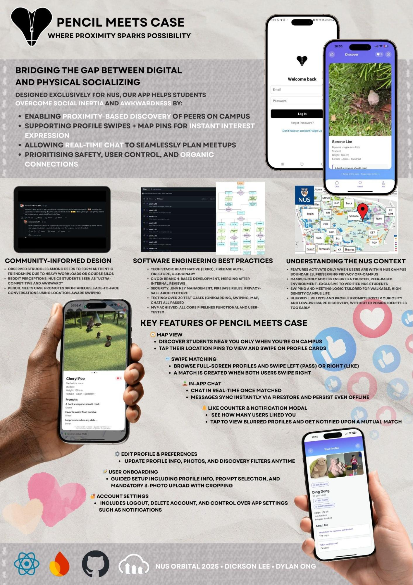

Link to Milestone 2 Video: [https://drive.google.com/file/d/10SmTArnnI43EZNyEW6AzR2Fkr7uKUSUg/view?usp=drive_link](https://drive.google.com/file/d/10SmTArnnI43EZNyEW6AzR2Fkr7uKUSUg/view?usp=drive_link)

## Milestone 1 Poster and Video

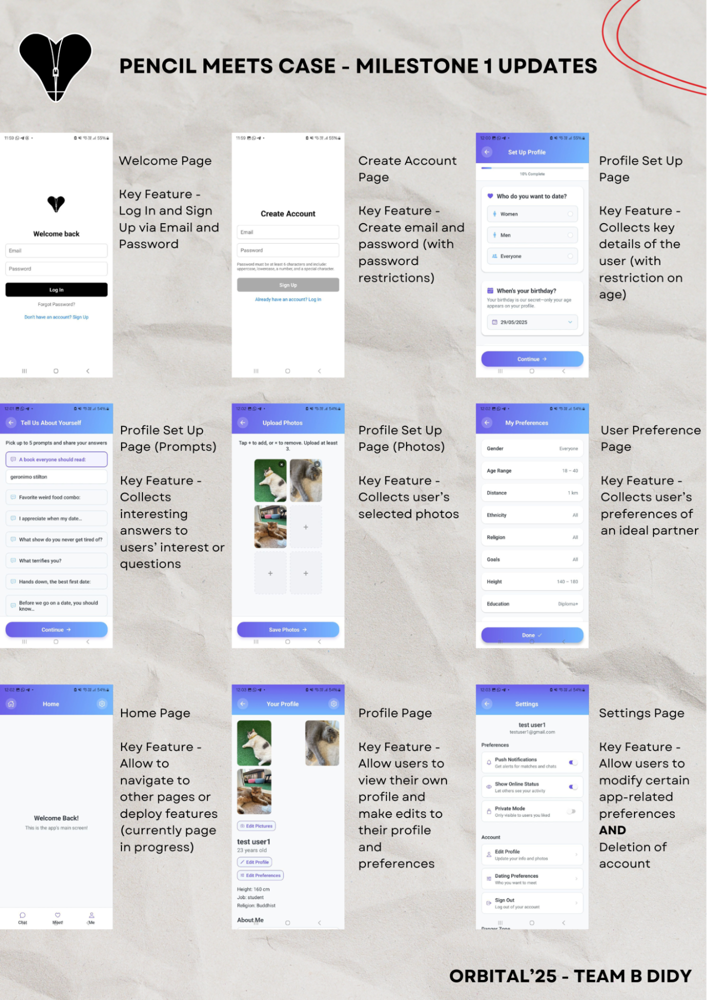

Link to Milestone 1 Video: [https://drive.google.com/file/d/1Ak7wjaVuChXjZMgauC_6p_kZHOWOhdOr/view?usp=sharing](https://drive.google.com/file/d/1Ak7wjaVuChXjZMgauC_6p_kZHOWOhdOr/view?usp=sharing)

## Liftoff Poster and Video

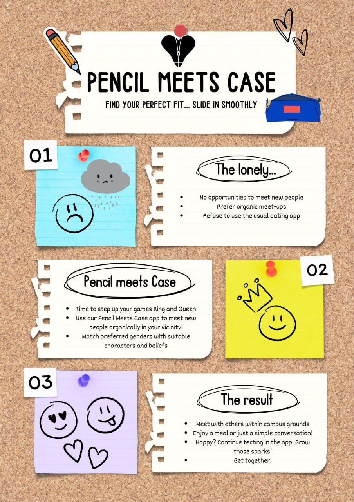

Link to Liftoff Video: [https://drive.google.com/file/d/1ZYFVRYlDtBYlinj1OpACq1UcBizDkzHy/view?usp=sharing](https://drive.google.com/file/d/1ZYFVRYlDtBYlinj1OpACq1UcBizDkzHy/view?usp=sharing)
